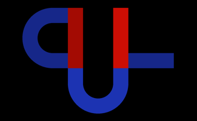

# UniCPP
### *The unique universal C++ framework for off-brand codery*

<div align="center">

</div>

## About UniCPP
UniCPP is a general-purpose framework, a collection of useful tools with a lot of features, maintained by KaiDamu.

## Why use UniCPP?
- **Universal** - It's useful in almost any C++ project, from small console apps to big GUI apps
- **Fast** - The framework uses and maintains optimized C/C++ code, therefore generally performant
- **Easy to use** - Naming is consistent and well-separated, many details are abstracted, therefore easy to learn
- **Cross-platform** - System-independent by default, with system-specific specializations, and supports both GCC and MSVC
- **Lightweight** - The code aims to be short and concise
- **Open-source** - It's free to use and modify (see LICENSE)

## Features & toolsets
- AES encryption (128/192/256, ECB/CBC/CTR)
- Console/Terminal features (async write & read, colors, ...)
- Color tools, pixel grids
- Graphics rendering (even without GPU)
- Direct draw on screen (with transparency support)
- An easy network protocol; UcNet (TCP, many built-in features)
- Process & thread & DLL toolset (low-level access)
- The BADA video codec (top #1 codec for black&white videos)
- Easy file/directory operations (memory-only files, list & process files, ...)
- String & character & file path processing toolset, arg list & command parser
- Many containers (shapes, bit vector, circular buffer, dynamic list, ...)
- Window toolset, screen capture
- Fast and easy math functions & big integer math
- Virtual user which simulates mouse movement and keyboard input
- Pixel path data compression (movement, outlines are stored well)
- SHA512 & MD5 & FNV1A64 hashing
- Self-balancing dictionary (AVL tree)
- Config file reader
- Asymmetric key exchange (secure, X25519)
- Digital signature generator and verifier (secure, Ed25519)
- Specialized arrays (small buffer optimized, object allocator pool, ...)
- Registry key toolset (read, write, check, copy, ...)
- Virtual file system (multiple files in one file)
- Raw socket toolset (for networking)
- Thread tasks (easy utilize all threads on chunked tasks)
- QOI image format support (read, create)
- Security token toolset
- Sandbox/Environment detector (for anti-sandboxing & targeted-execution)
- Memory operations toolset, memory pool
- Mouse & Keyboard & Gamepad/Joystick state reader & input emulator
- 2D/3D vector toolset
- Hunic rune language converter & renderer (simplified alphabet)
- Type converter functions (fast int to string, string to float, ...)
- Time & timer toolset (hi-res timer, uniform cpu-based timer, ...)
- Code generator (customizable automation)
- Automatic feature detection & tuning (compiler, system, architecture, ...)
- Sorting algorithms (float radix sort, non-recursive quick sort, ...)
- Simplified protobuf toolset
- Advanced data serializer & deserializer
- Easy function performance tester
- Uniform/Crypto random generator
- Inter-process communication (using pipes)
- Clipboard handling (multiple data types, read, write, ...)
- Screen/Monitor toolset (get size, set resolution, force update, ...)
- Thread synchronization toolset (fast lock, events, multi-lock, ...)
- Uniform main function & auto runtime setup & easy arg reader
- Custom keywords & variable types (for simplicity & modularity & abstraction)
- Dumb functions (short codes to break the system in various ways for fun)
- Additional data types (dynamic stack, flexible queue, tuple, keyval, ...)
- Compile-time type detection & type traits
- System-level toolset (system version, shutdown, BSOD, ...)
- Easy error handling system
- Atomic operations
- And more / more to come...

## Simple example
```cpp
#define PROG_BUILD_TYPE_DBG
#include <unicpp/main.hpp>
#include <unicpp/console.hpp>
ER Main() {
    ConWrite("Hello, &e;world!");
    ConWait("&9;Press [ENTER] to exit ", ConWaitAnim::SPINNER);
    rets;
}
```

## Requirements
- Standard: use C++20 (or later)
- Compiler: GCC 10+ or MSVC 17+
- System: Windows 7+ or ESP32 or (untested) Linux
- Architecture: 64-bit or 32-bit
- Dependencies: none (besides the standard library & platform SDK)

## Additional conditional requirements
- Suggested for linker on GCC/Windows: "-lgcc -lntdll -lpsapi -lkernel32 -lws2_32 -lshcore -lmsvcrt -lwinmm -lhid -lsetupapi -lgdi32 -lopengl32 -liphlpapi -lxinput -lole32 -loleaut32 -luserenv -lgdiplus -ldwmapi -ld3d11"
- In case of a #define conflict: include UniCPP after other headers
- In any case: have a willingness to use off-brand implementations

## Stats
- Start of development: 2022 Nov. (based on King3-lib from 2019)
- Lines of code: 20000+
- Languages used: C++, C, ASM

## Disclaimer
This framework is released as an experimental project and is provided on an "AS IS" basis without any warranties.
By using this framework, you acknowledge and agree to the terms and limitations outlined in the full disclaimer.
For the complete terms and usage guidelines, please refer to file "DISCLAIMER.md".

## Fun
- [Trailer](https://www.youtube.com/watch?v=iklTSxr35Qc) (symbolism)
